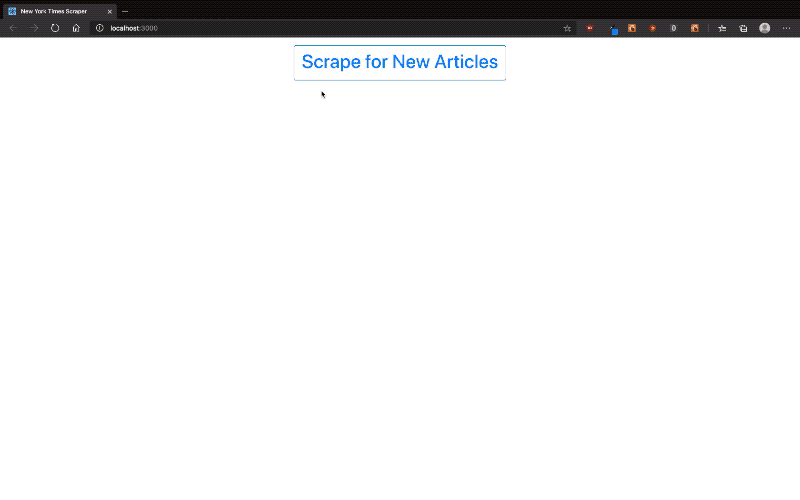

# New York Times Scraper

## Technologies Used
* MERN stack
* Express for server backend and proxying API requests
* React & react-bootstrap for a tidy front end
* Mongo to store data from the API requests
* Cheerio and axios to download and scrape the target webpage

## Starting the app locally

Start by installing front and backend dependencies. While in this directory, run the following command:

```
npm install
```

This should install node modules within the server and the client folder.

After both installations complete, run the following command in your terminal:

```
npm start
```

Your app should now be running on <http://localhost:3000>.

## [Live Deployed Link](https://nyt-scraper-kcilia.herokuapp.com/)

# Demo
